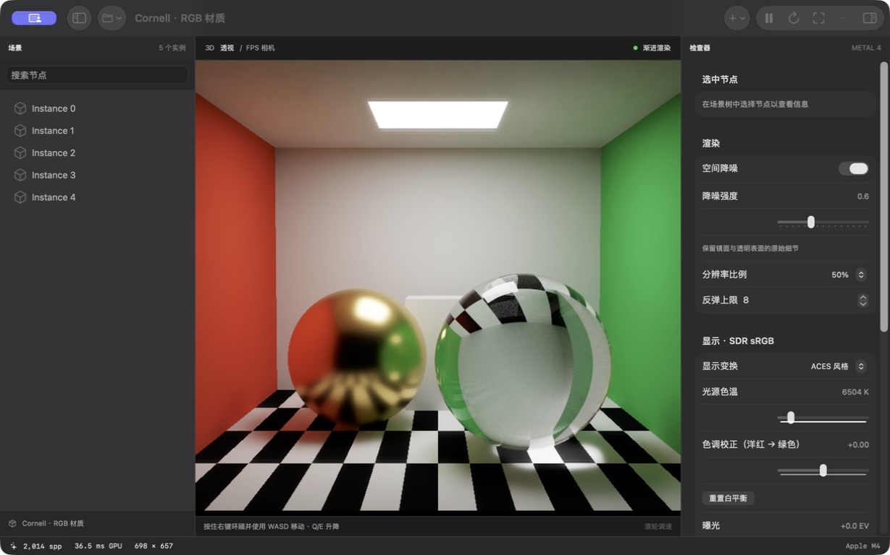

# MetalPT

MetalPT 是面向 Apple Silicon 的 GPU 路径追踪器，使用 Swift、Metal 4 和 Metal Shading Language 实现。项目包含波前渲染管线、基于物理的材质系统、glTF 2.0 资产导入，以及用于场景浏览和灯光编辑的原生 macOS 应用。

渲染器通过硬件光线求交计算直接与间接光照，在线性 RGB 空间中渐进累积。GPU Pass 的依赖、同步和资源生命周期由 Render Graph 管理，应用界面使用 SwiftUI 和 MetalKit。



*Cornell 内置场景，Apple M4，50% 渲染比例，8 次表面交互，空间降噪开启。*

[构建与运行](#构建与运行) · [功能](#功能) · [文档](#文档) · [测试与验证](#测试与验证) · [许可证](#许可证)

## 构建与运行

### 环境要求

| 组件 | 要求 |
| --- | --- |
| 操作系统 | macOS 27.0 或更新版本 |
| 硬件 | Apple M3 或更新的 Apple Silicon |
| 开发工具 | Xcode 27，已安装 Metal Toolchain |

在 Xcode 中打开 `MetalPT.xcodeproj`，选择 **MetalPT / My Mac** 并运行。也可以从命令行构建：

```sh
xcodebuild -project MetalPT.xcodeproj -scheme MetalPT \
  -configuration Debug \
  -derivedDataPath /tmp/MetalPT-build \
  CODE_SIGNING_ALLOWED=NO build
```

构建产物位于 `/tmp/MetalPT-build/Build/Products/Debug/MetalPT.app`。

### 使用

应用提供 Cornell 材质场景和玻璃棱镜场景。通过工具栏打开模型，或将 `.gltf` / `.glb` 文件拖入视口。包含外部 buffer 或图片的 glTF 应通过「打开模型文件夹」授予目录读取权限。模型加载完成后自动取景；场景树保留节点名称与父子层级。

按住鼠标右键环顾，使用 W/A/S/D 水平移动、Q/E 升降、Shift 加速，滚轮调整移动速度。工具栏与检查器提供灯光编辑、相机设置、暂停和重新累积等操作。

默认以视口宽高的 50% 渲染，每帧累积 1 spp，最多执行 8 次表面交互，并启用空间降噪。相机、场景、渲染尺寸或路径深度变化会重置累积；曝光、白平衡、色调映射和降噪设置变化保留累积结果。

## 功能

### 光照与材质

- 波前路径追踪，GPU 路径与阴影队列压紧，间接 dispatch。
- 硬件三角形求交、两级加速结构与共享网格实例。
- 直接光采样（NEE）、多重重要性采样（MIS）与俄罗斯轮盘路径终止。
- Lambert 漫反射、Metallic-Roughness 和 Specular-Glossiness PBR；GGX 微表面模型与可见法线（VNDF）采样。
- 理想玻璃的 Fresnel 反射、折射与全反射，固定折射率 1.5；近似 RGB 黄金材质。
- 薄表面透射、附加发光、矩形面积灯，以及点光源、聚光灯和平行光。

### 资产与场景

- glTF 2.0 / GLB 静态场景导入，包括三角形、三角带、三角扇、共享网格和多材质实例。
- 稳定 ID 场景图、层级变换、可见性与网格局部材质槽。
- UV0/1、顶点颜色、平滑法线、切线空间法线贴图、纹理变换、采样器与 mip 链。
- PNG/JPEG 图片、颜色纹理 sRGB 解码与线性数据纹理。
- 单双面表面及 OPAQUE、MASK、BLEND 覆盖模式。
- 异步模型加载、自动取景，以及解析灯光的添加、编辑和删除。

支持的 glTF 扩展和资产兼容性说明见 [glTF 导入](docs/gltf-import.md)。

### 相机与显示

- FPS 相机与薄透镜景深。
- FP32 线性 RGB 渐进累积。
- 法线、深度和反照率引导的三轮 à-trous 空间降噪；滤波结果与原始累积分离。
- 曝光、Bradford 白平衡、ACES 风格曲线、亮度 Reinhard 和线性裁剪。
- SDR sRGB 输出。

## 实现边界

当前积分器使用 RGB，不支持光谱采样或色散。尚未实现体积散射与吸收、嵌套介质、专门的焦散算法或时间降噪。glTF transmission 使用薄表面模型；厚玻璃的 volume / IOR 扩展尚未支持。

模型导入使用静态姿态，不支持动画播放、蒙皮或 morph targets。灯光编辑保存在内存中，尚无场景保存与导出功能。

渲染调度采用单队列和整资源级依赖，尚未实现子资源跟踪、内存别名、多队列调度或 TLAS refit。显示输出为 SDR，不包含完整 ACES、ICC/OCIO 或 HDR 管线。

## 文档

- [渲染器架构](docs/architecture.md)：场景快照、BSDF、Render Graph、资源驻留与显示处理。
- [glTF 导入](docs/gltf-import.md)：支持的扩展、加载流程、兼容性与性能诊断。
- [表面资产](docs/surface-assets.md)：几何、材质、图片、纹理与采样器语义。
- [RGB 验证](docs/validation/rgb.md)、[BSDF 验证](docs/validation/bsdf.md)、[VNDF 验证](docs/validation/vndf.md)：数值检查与渲染结果。
- [空间降噪验证](docs/validation/spatial-denoise.md)、[景深降噪验证](docs/validation/dof-denoise.md)：滤波行为与实现限制。

## 测试与验证

运行 CPU 测试：

```sh
scripts/test-graph.sh
scripts/test-gltf.sh
```

测试覆盖 Render Graph、共享 ABI、场景层级、材质绑定、表面资产与 glTF 解析。GPU 验证执行生产 Shader，检查采样与材质、颜色输出、资源绑定和累积失效等行为。

```sh
# Metal API / Shader Validation
scripts/validate-gpu.sh validation

# 薄表面透射专项验证
METALPT_TRANSMISSION_VALIDATE=1 scripts/validate-gpu.sh validation

# Metal GPU Capture，与 Shader Validation 分开运行
scripts/validate-gpu.sh capture

# Release 渲染与性能记录
METALPT_SPP=512 scripts/validate-gpu.sh release
```

环境变量统一使用 `METALPT_` 前缀。`METALPT_OUTPUT` 指定报告目录；`METALPT_PROFILE=1` 启用逐 Pass GPU 时间戳。时间戳测量会引入额外同步开销，常规性能比较应关闭该选项。

代码格式化使用 `scripts/format.sh`，依赖 Xcode 的 `swift-format` 和 `clang-format`。

## 许可证

MetalPT 使用 [MIT 许可证](LICENSE)。
