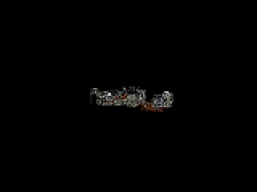

# Bistro 无效切线容错验证

2026-09-09，Apple M4，Debug + Metal API Validation / Shader Validation。

## 原因

独立 Python 扫描 `models/bistro.glb` 原始浮点字节，发现 12 个 TANGENT accessor 中共 847 条记录含 NaN（典型值为 NaN/NaN/NaN/0）；其他浮点 accessor 未发现 NaN/Inf。该数据已存在于原文件，并非批量读取或切片优化产生。

Accessor 编号：193、328、408、553、908、918、938、1228、1443、1448、2658、2673。

进一步按有效方向、有限值和 w=±1 检查，共有 13552 条无效切线。导入器只对 TANGENT 允许读取非有限值，再逐顶点清除无效切线的属性标记，保留有限默认字段。受影响三角形使用生产着色器已有的 UV 导数路径；有效顶点切线继续保留。退化 UV 无法形成有效切线时不应用法线贴图偏移。UI 会报告修复数量。

POSITION、NORMAL、UV 等其他数据继续严格校验，不以零值掩盖关键数据错误。异常消息包含 accessor、记录和分量编号。

## 检查

- glTF CPU 测试通过：有效切线不变，NaN/零切线标记清除，修复数量可见，默认 accessor 解码仍拒绝 NaN，POSITION NaN 仍拒绝加载。
- 使用 Bistro 原始几何和全部材质定义、仅替换图片负载为 1×1 PNG 的 CPU 审计通过：551 个网格、2909 个可渲染实例、254 个源材质及一个默认材质，检测到 13552 条无效切线。
- 完整生产 GPU 回归通过，新增单个顶点缺少切线时的法线贴图检查：三角形改用 UV 导数构造的切线空间，与该测试平面的有效导出切线结果一致。回归报告见 [切线回退 GPU 检查](tangent-regression.json)。
- 随后直接读取完整原始 Bistro，包含全部真实图片，经过实际异步导入、纹理上传、场景安装和生产 GPU 渲染，通过旧请求取消及失败保留场景检查。查看灯加入后为 553 个网格、2911 个实例。
- 320×240 输出、160×120 内部分辨率、4 spp、8 次反弹。队列溢出与非有限值均为零，验证层未报告 GPU 错误。已查看输出；该低采样远景只用于集成验证，不代表材质质量评估。

本次完整导入到安装完成约 74.823 秒：读取容器 0.041 秒，图片解码/几何解析/编译 62.856 秒，取景及校验 1.887 秒，纹理准备 6.943 秒，主线程安装 3.071 秒。不包含首帧加速结构构建。图片解码仍是大型 Bistro 的主要等待阶段。

报告：[完整原始 Bistro](bistro-tangent.json)。

```sh
scripts/test-gltf.sh
METALPT_GLTF="$PWD/models/bistro.glb" METALPT_IMPORT_PROFILE=1 METALPT_SPP=4 METALPT_WIDTH=320 METALPT_HEIGHT=240 scripts/validate-gpu.sh validation
```


