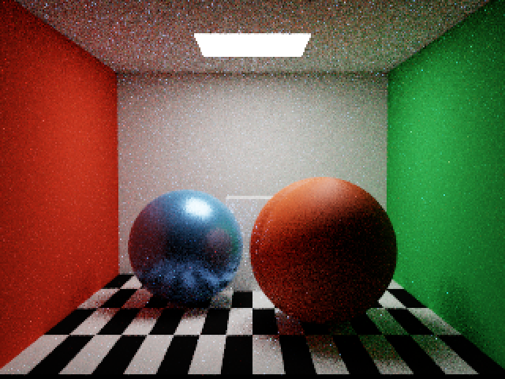

# 材质工作流与 BSDF 重构验证

2026-09-09，Apple M4。新增 Specular-Glossiness 工作流与公共 SurfaceParameters，统一理想玻璃采样接口。PTMaterial 从 368 扩至 432 字节；PTPath / PTScene 保持 80 字节。

## 已完成检查

- Debug 构建通过；仅有缺少 AppIntents 依赖而跳过元数据提取的警告。
- `scripts/test-graph.sh` 与 `scripts/test-gltf.sh` 通过。新增 SG 因子/默认值、优先于 MR 回退、纹理变换、透明覆盖绑定、非法参数及共享 ABI 布局检查。
- 完整 Metal API / Shader Validation：640×480 输出、320×240 内部、32 spp、8 次反弹的 Cornell / 棱镜及既有生产回归通过。SG 的 sRGB 镜面 RGB、线性 glossiness alpha、漫反射/顶点色/覆盖参数、互易性、能量和混合 PDF 通过。MASK/BLEND 在 MR 和 SG 下的主射线及阴影结果一致。
- 统一玻璃接口：验证正反面 η、辐亮度 η² 与俄罗斯轮盘补偿、Fresnel 采样频率、离散 PDF、反射/透射事件以及全反射。
- 薄表面透射专项：320×240 输出、160×120 内部、128 spp、8 次反弹，通过光滑/粗糙透射、纹理通道及能量/PDF 检查。
- SG glTF 专项：由 CPU 测试生成 `/tmp/specular-glossiness-fixture.glb`，包含 MR 回退与 SG 纹理；320×240 输出、160×120 内部、32 spp、8 次反弹，实际异步解析、上传、安装与 GPU 渲染通过，过期请求丢弃及失败保留场景通过。
- 各 GPU 运行队列溢出和非有限值为零，验证层未报告 GPU 错误。
- 已查看 SG 材质球与棱镜图像：SG 可见独立镜面颜色与漫反射颜色，玻璃折射保留；低 spp 噪声仍可见。本次没有进行完整 Bistro 大场景渲染、Release 性能测量或 Metal Capture。

数值报告：[生产回归](bsdf-debug.json)、[透射专项](bsdf-transmission.json)、[SG glTF](bsdf-gltf.json)。GPU 验证层耗时不作为性能基线。

## 复现

```sh
scripts/test-graph.sh
scripts/test-gltf.sh
SPECTRAL_SPP=32 scripts/validate-gpu.sh validation
SPECTRAL_TRANSMISSION_VALIDATE=1 SPECTRAL_WIDTH=320 SPECTRAL_HEIGHT=240 scripts/validate-gpu.sh validation
SPECTRAL_GLTF=/tmp/specular-glossiness-fixture.glb SPECTRAL_SPP=32 SPECTRAL_WIDTH=320 SPECTRAL_HEIGHT=240 scripts/validate-gpu.sh validation
```


