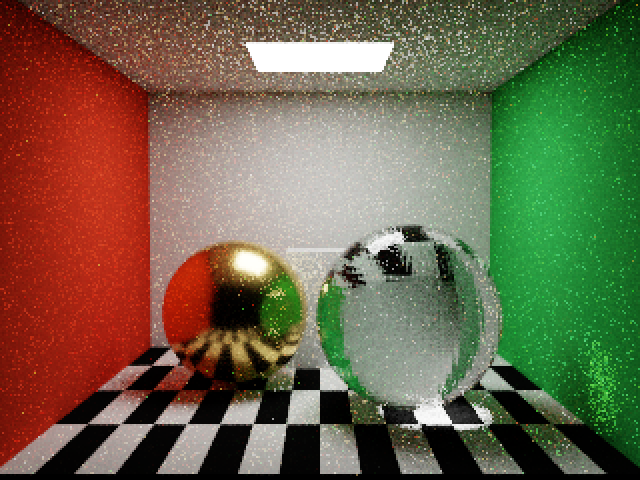
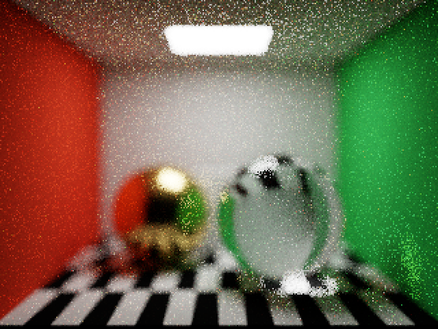
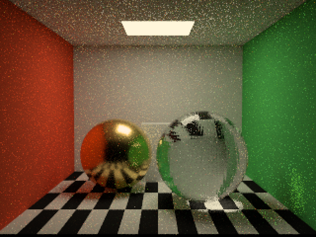

# 相机与显示变换验证

2026-09-09，Apple M4，Debug，Metal API Validation 与 Shader Validation 均启用。

- 命令：`scripts/test-graph.sh`；`METALPT_OUTPUT=/tmp/MetalPT-camera-display scripts/validate-gpu.sh validation`。
- 构建、相机、Render Graph/ABI、现有 GPU 回归和新增相机/显示回归全部通过。
- Cornell 场景，内部 320×240，输出 640×480，64 spp，反弹上限 8；不使用空间降噪。
- 景深图：圆形孔径半径 0.15，对焦距离 4（场景单位）。已人工检查散焦轮廓；64 spp 仍存在蒙特卡洛噪声。
- 暂停期间修改白平衡和三种显示模式，采样数保持不变；恢复默认后与原图逐像素一致。
- 开启景深和修改对焦距离均重置采样，GPU 无溢出或非有限路径诊断。

## 针孔与景深

## 显示变换

亮度 Reinhard、光源色温 9000 K、色调 +0.2：

## 范围

默认保留针孔、6504 K 中性白平衡和 ACES 风格曲线。景深采用归一化薄透镜响应，不模拟镜头透过率或自动曝光；非零孔径现已支持孔径积分引导降噪，详见 [景深降噪验证](dof-denoise.md)；本页旧对比图未启用降噪。白平衡使用日光轨迹近似和 Bradford 色适应，支持 4000–25000 K。显示为 SDR sRGB，提供 ACES 风格、亮度 Reinhard（含向中性色压缩色域）和线性裁剪，不包含完整 ACES/OCIO 或 HDR 输出。

## 审查修正回归

使用 `METALPT_OUTPUT=/tmp/MetalPT-review-fixes scripts/validate-gpu.sh validation` 重新验证通过。针孔和景深对比均关闭降噪，避免混入过滤变化。新增 GPU 核调用生产 `cameraRay`，由 CPU 独立检查旋转相机下的针孔起点、孔径半径、镜头平面、方向单位长度，以及对焦距离 4/8 时多条射线汇聚至预期焦平面位置。验证环境仍为 Apple M4、Debug、API/Shader Validation 开启。
