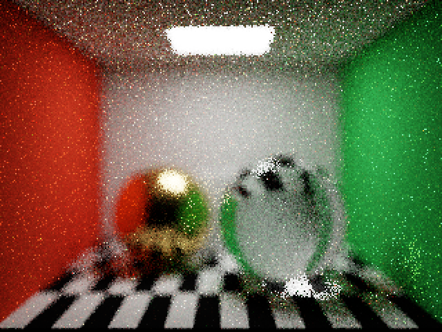
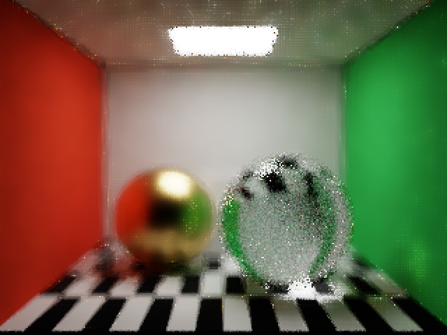
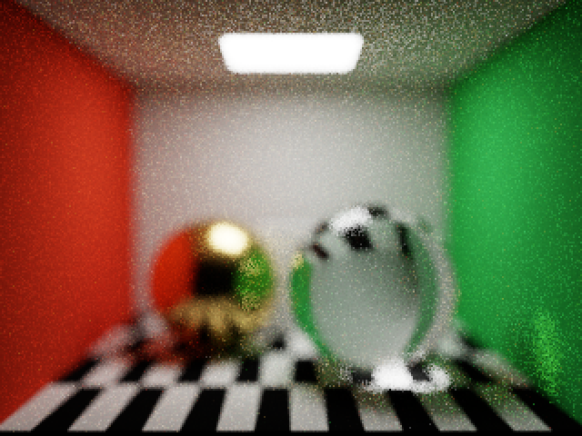
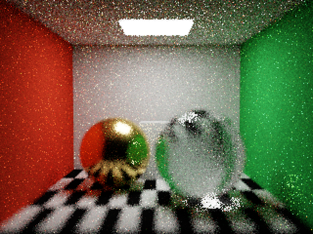
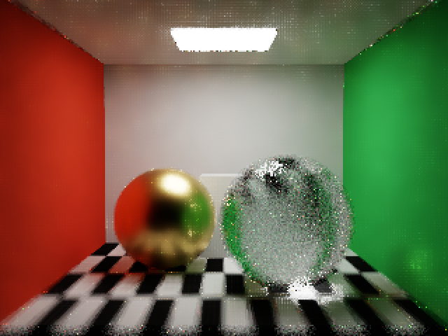
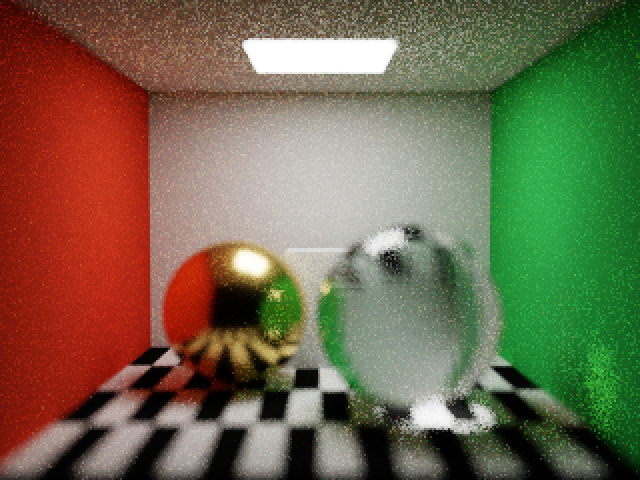

# 景深与空间降噪

2026-09-09，Apple M4，Debug，Metal API Validation 和 Shader Validation 均启用。

景深开启后保持空间降噪。相机主射线与引导射线共享薄透镜构造函数；引导对 16 个固定、成对分布的孔径样本取平均法线、底色、轴向深度及深度标准差。混合表面使用分布差异过滤；法线一致的平面使用平面距离，避免倾斜地面、天花板因轴向深度差异而产生条纹。针孔模式保留原有过滤方式。

## 验证

- `scripts/test-graph.sh` 通过。
- `SPECTRAL_OUTPUT=/tmp/MetalPT-dof-denoise-final scripts/validate-gpu.sh validation` 构建及全部 GPU 回归通过。
- Cornell 场景，内部 320×240，输出 640×480，反弹上限 8，孔径半径 0.15；16 spp 原图与降噪图共用同一份累积，参考图为 256 spp 未降噪结果。
- 验证暂停时启用降噪不重置累积，重复显示逐像素稳定，关闭降噪逐像素恢复原图。
- 验证两个对焦距离的全图与左墙/后墙交界区域误差下降。MSE 在 SDR 显示 RGB 上计算，参考图包含原来的 16 个样本，不代表独立的无噪声真值。

| 对焦距离 | 原图 MSE | 降噪 MSE | 全图误差下降 | 墙角区域误差下降 |
| --- | --- | --- | --- | --- |
| 4 | 0.008465 | 0.003506 | 58.6% | 78.4% |
| 8 | 0.008338 | 0.003646 | 56.3% | 78.6% |

## 图像检查

已检查两个焦距的原图、降噪图和参考图。墙面、地面的噪声减少，散焦轮廓仍然保留；倾斜平面的方向性条纹已减轻。玻璃及混合边界保留明显噪声，少量格状残留仍可见。

对焦距离 4，依次为 16 spp 原图、16 spp 降噪、256 spp 参考：

对焦距离 8：

## 限制

这是有限孔径样本的空间降噪近似，会增加引导射线开销。任一引导样本落在透明、近镜面、发光、alpha 表面或未命中场景时，保守保留该像素；因此玻璃、复杂遮挡和细小高光仍需更多路径样本。没有引入时间累积降噪或学习型降噪。

## 审查修正回归

景深分支现在用几何法线判定共面性，着色法线仅影响法线相似度。新增生产 `spatialDenoise` 合成回归：同一倾斜几何平面具有长度小于 1 的孔径平均着色法线和交替行噪声，断言内部像素恢复到已知常量值附近，避免错误切换轴向深度度量导致条纹。

`scripts/test-graph.sh` 和 `SPECTRAL_OUTPUT=/tmp/MetalPT-review-fixes scripts/validate-gpu.sh validation` 均通过；已检查更新图像，原有景深和降噪效果保留。
