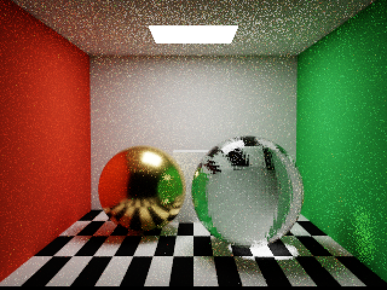
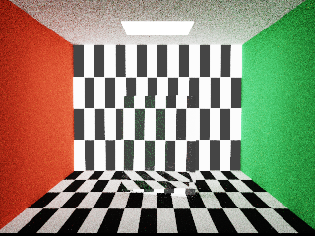

# RGB 重构验证

2026-09-09，Apple M4。本轮将生产渲染、BSDF、发光、吞吐量和累积统一为线性 RGB，移除波长/PDF、CIE/XYZ、Au 数据表、Sellmeier 和色散 UI。PTPath 从 112 缩至 80 字节，PTScene 从 96 缩至 80 字节；CPU 静态断言、运行时断言和测试均已同步。

## 检查结果

- Debug / Release 构建通过；唯一构建警告为无 AppIntents 依赖，跳过其元数据提取。
- `scripts/test-graph.sh`、`scripts/test-gltf.sh` 通过，包含场景图、primitive、图片、ABI 与 glTF 数据解析。
- Debug Metal API Validation + Shader Validation：640×480 输出，320×240 内部分辨率，32 spp，8 次反弹。完整生产回归通过，RGB 漫反射通道保持、Fresnel/TIR、GGX 归一化、黑场、PBR 能量与 PDF、透明覆盖、BLAS 复用、绑定、暂停/曝光和历史失效均通过。RGB 显示检查将已知颜色经过真实累积和显示 Pass，与 CPU 参考比较，检查 RGB 通道顺序与一次 sRGB 编码。
- 透射专项：320×240 输出，160×120 内部分辨率，128 spp，8 次反弹。纹理 R 通道、能量、着色、金属不透射、粗糙双半球 PDF 和 opaque/partial/clear/rough 图像检查通过。
- glTF 专项：CPU 测试生成的 `/tmp/spectral-import-fixture.glb`，320×240 输出、160×120 内部分辨率，32 spp、8 次反弹。实际异步导入、旧请求丢弃、失败保留场景及 GPU 渲染通过。
- 所有上述 GPU 运行的队列溢出和非有限值均为零；验证层未报告 GPU 错误。
- Release：640×480 输出、320×240 内部分辨率，128 spp、8 次反弹，未启用验证层；完整回归通过。Cornell GPU 中位数 6.895 ms，棱镜 4.392 ms，排除前 4 帧；仅作本次运行观察，不与旧光谱版本作严格性能比较。
- 已人工检查 Cornell、棱镜、PBR 和透射图像。玻璃折射保留，棱镜没有波长色散。RGB 墙面间接染色及低采样噪声仍可见，没有去噪。此次未重新抓取 Metal Capture。

## 复现

```sh
scripts/test-graph.sh
scripts/test-gltf.sh
METALPT_SPP=32 scripts/validate-gpu.sh validation
METALPT_TRANSMISSION_VALIDATE=1 METALPT_WIDTH=320 METALPT_HEIGHT=240 scripts/validate-gpu.sh validation
METALPT_GLTF=/tmp/spectral-import-fixture.glb METALPT_WIDTH=320 METALPT_HEIGHT=240 METALPT_SPP=32 scripts/validate-gpu.sh validation
METALPT_SPP=128 scripts/validate-gpu.sh release
```

项目和 `METALPT_` 环境变量名称保留以兼容既有工作流。报告：[Debug](rgb-debug.json)、[Release](rgb-release.json)、[透射](rgb-transmission.json)、[glTF](rgb-gltf.json)。旧光谱报告与图片保留为历史记录，不作为 RGB 像素基线。




