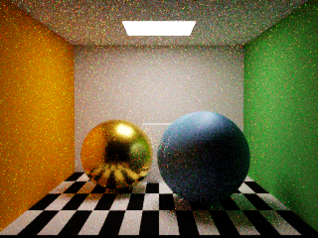

# Primitive / 纹理 / PBR 验证

2026-09-08，Apple M4，macOS 26.6.2，Xcode 26.6。

Debug 与 Release 构建通过；`scripts/test-graph.sh` 通过。Debug 开启 `MTL_DEBUG_LAYER=1 MTL_SHADER_VALIDATION=1` 完成生产渲染和 GPU 数值检查，未报告驻留、越界或同步错误。Release 独立执行相同回归通过。

## 运行参数

```sh
xcodebuild -project SpectralPT.xcodeproj -scheme SpectralPT -configuration Debug \
  -derivedDataPath /tmp/SpectralPT-pbr CODE_SIGNING_ALLOWED=NO build
MTL_DEBUG_LAYER=1 MTL_SHADER_VALIDATION=1 METALPT_VALIDATE=1 METALPT_SPP=32 \
  METALPT_OUTPUT=/tmp/SpectralPT-pbr-final \
  /tmp/SpectralPT-pbr/Build/Products/Debug/SpectralPT.app/Contents/MacOS/SpectralPT
```

Release 将配置和路径中的 Debug 改为 Release，并移除 Metal 验证环境变量。输出 640×480、内部 320×240、32 spp、8 次反弹。Release 普通场景每帧 GPU 时间中位数（排除前四帧）：Cornell 10.076 ms，Prism 6.516 ms；这些数值不包含 CPU 场景编译耗时，也不是 PBR 展示图的专项基准。

## 回归覆盖

- CPU：共享索引顶点、primitive 范围及同材质边界、非法索引拒绝、属性修改失效、PNG 行序/通道、奇数尺寸 mip、sRGB 线性光平均、缺失 UV/采样器拒绝和新 ABI。
- GPU：sRGB 与线性纹理视图、UV0/UV1、平移/旋转、显式 mip、最近点/线性、repeat/clamp/mirror；纹理/采样器 ID 在列表重排后仍保持正确绑定。
- 材质：MR 的 G/B 通道、顶点 alpha、发光纹理、AO 采样、可叠加发光的反射 lobe；PBR 互易性、白炉积分、混合采样频率与 PDF 积分对照、零粗糙度数值稳定性。
- 法线：逆转置、负缩放朝向、镜像矩形灯、切线法线贴图以及缺失法线回退。
- 覆盖：主路径和阴影的 MASK、单/双面、BLEND；两层 0.5 覆盖的阴影透过率为 0.25。4096 次主路径采样命中率为约 0.746（理论 0.75）。射线专门落在共享三角形边上，防止重复应用 alpha。
- 原有 CIE、色散、TIR、黑场、队列/非有限值、场景图、暂停、重置和缩放回归继续通过。

球体现在具备连续球面 UV 和解析切线，非 delta BSDF 使用平滑着色法线。新图像与旧几何法线版本不要求逐字节一致。



[Debug 报告](surface-assets-report.json) · [Release 报告](surface-assets-release-report.json) · [Metal 验证日志](surface-assets-validation.log)。具体功能边界见 [表面资产说明](../surface-assets.md)。
